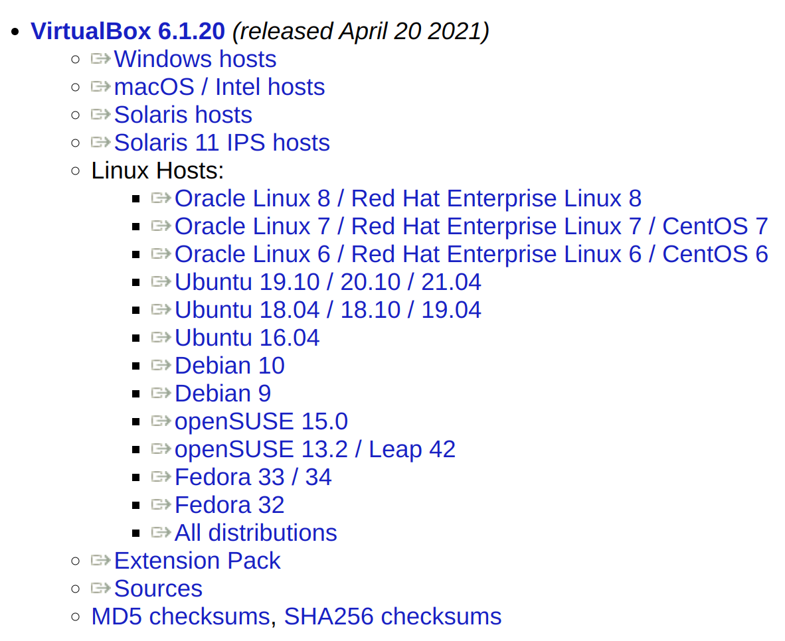
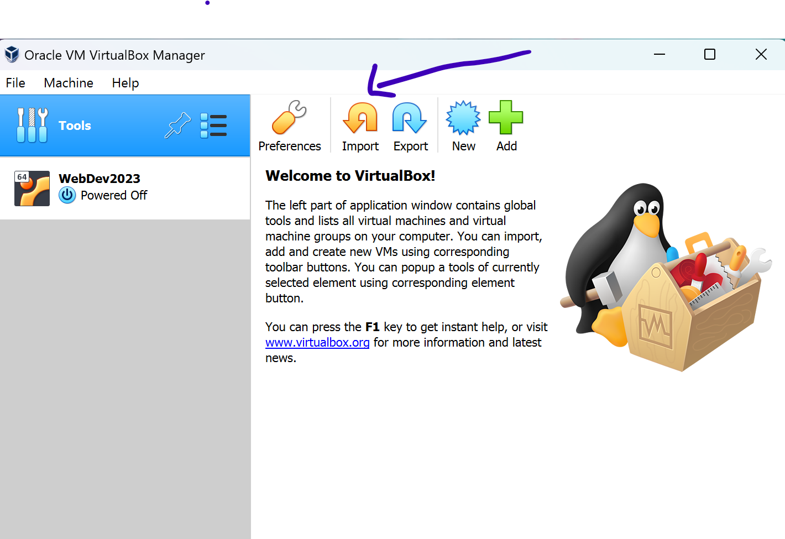
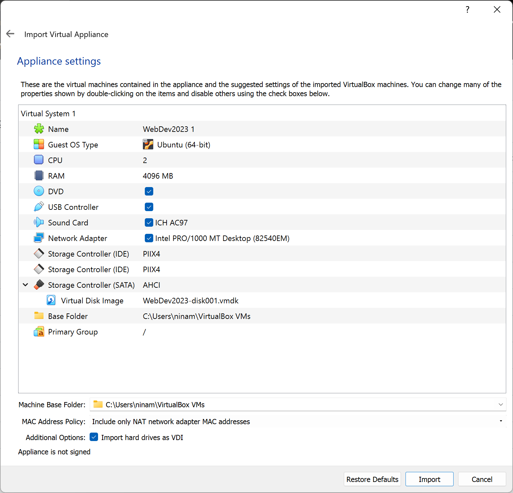

# Ubuntu-setup-virtualbox
### A guide to install Ubuntu OS in VirtualBox
*The information in this guide is based on the work/materials by Robert Bierman and Andrew Scott of SF State CS Dept re: CSC 317 course. (Additional information is included from other online sources.)*

This guid has two different sections: Intel CPU architecture and MacBook M1/M2/M3. Refer to the section that matched your computer's CPU architecture, please. 

### Intel 64bit 
**Step. 1** download and install VirtualBox version VirtualBox 6.1.20 (released April 20 2021) + Package Extension file from the followin link. Refer to the image below from the same link for more info.
Link: https://www.virtualbox.org/wiki/Download_Old_Builds_6_1

First, install VirtualBox on your machine. Then, click on its icon. You should see the following image. 

Click on **Tools**. Then, click on File>Preferneces>Extensions. Now, click on the plus button to add the Extension Package file that you downloaded earlier. Press OK and exit. 

**Step.2**
In this step, we will install Ubuntu 22.04 LTS	Jammy Jellyfish using the VirtualBox. First, you need to downloand an OVA file containing an image of Ubuntu OS that has VSCode and Node.js already installed on it from this link: https://sfsu.app.box.com/v/csc317webdevova 

Note: It is a large file of 6.9 GB. It will take minutes to hours depending on your internet connection to download. 

After the OVA file is downloaded. Go the main menu of Virtualbox. Now, press on **Import** button on the right side as seen below.

Now, press on the folder button as seen below and select the OVA file on your hard drive. Then, press **Next**.

Do not change any default values in this step but pay attentin to the displayed information about the to-be-created virtual machine.
The image below is an example.

Press **import**.
This step may take a few minutes.

**Step.3**
If all the previous steps are successfully completed, you should see a WebDec2023 **_machine_** on your VirtualBox menue. Click on it!

After selecting you new _machine_, you should see a similar menue. Click on **_Start_** button to boot your Ubuntu machine.

