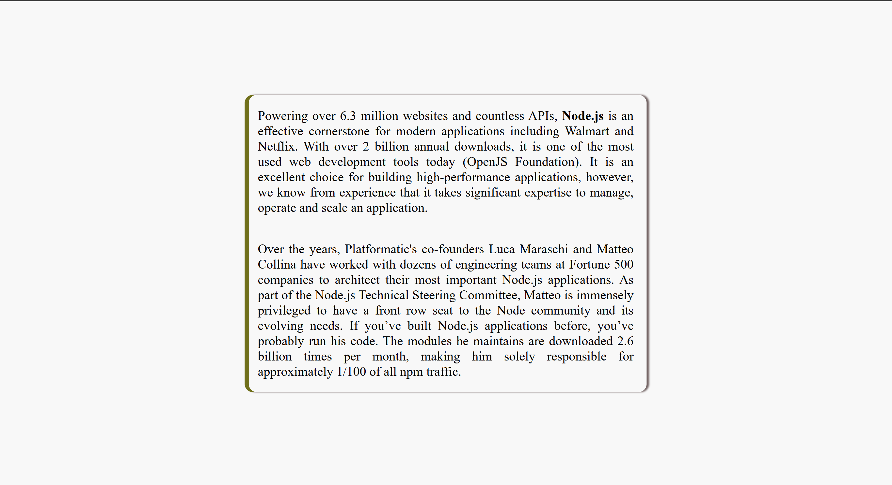

# Thursday Participation Activity

## Box-model & centring elements using ```position: absolute```

You are given the following two paragraphs: 
<pre>
    Powering over 6.3 million websites and countless APIs, Node.js is an effective cornerstone for modern applications including Walmart and Netflix. With over 2 billion annual downloads, it is one of the most used web development tools today (OpenJS Foundation). It is an excellent choice for building high-performance applications, however, we know from experience that it takes significant expertise to manage, operate and scale an application.

    Over the years, Platformatic's co-founders Luca Maraschi and Matteo Collina have worked with dozens of engineering teams at Fortune 500 companies to architect their most important Node.js applications. As part of the Node.js Technical Steering Committee, Matteo is immensely privileged to have a front row seat to the Node community and its evolving needs. If you’ve built Node.js applications before, you’ve probably run his code. The modules he maintains are downloaded 2.6 billion times per month, making him solely responsible for approximately 1/100 of all npm traffic.
</pre>
you are asked to create the following output with the above given text:



The result is centered both vertically and horizontally in the viewport. 

## Steps
### setup
1. create a directory on your machine today's date under your CSC317 folder.
2. create an html file in that folder called box.html and populate it with boilerplate html
3. make sure your html document is a valid html5 document and give it a title of box centring
4. link to a CSS file in the head of your html doc. the CSS file is called box.css
5. within the ```<body>``` of your html doc, create a ```<div class="wrapper">```
6. nest two paragraph elements in the div matching the given text

### CSS styling
c1. overwrite padding and margin values globally to zero. hint: *

c2. make sure ```body``` has a background color of #f8f8f8.

aside: you could also make sure ```body``` covers the 100% of the viewport height hint: ```height:100vh;```. this is not needed for this activity but is needed when we try to do the same thing using ```flexbox``` layout. 

c3. ```wrapper``` needs to have a width of 45% of its parent element. in this case, the parent is ```body```. 

c4. wrapper also needs the following [feel free to change the given values as you see fit]: 
```css
box-shadow: 5px 0 rgb(112, 112, 27) inset, 
    3px 0 2px rgb(114, 99, 99);
border-radius: 10px;

```

c5. for the ```<p>``` styling, try the follwoing [feel free to change the given values as you see fit]: 
```css
p{
    height: 25%;
    /* word-break:normal; */
    /* text-align: justify; */
    padding: 1rem;
}
```

## how to center it now?!

we need to center the wrapper div to do this task. So, let's add more CSS rules to it!
```css
position: absolute;
top:50%;
left:50%;
transform: translate(-50%, -50%);
```

Please have a look at this ***amazing*** article on MDN:
https://developer.mozilla.org/en-US/docs/Web/CSS/position
