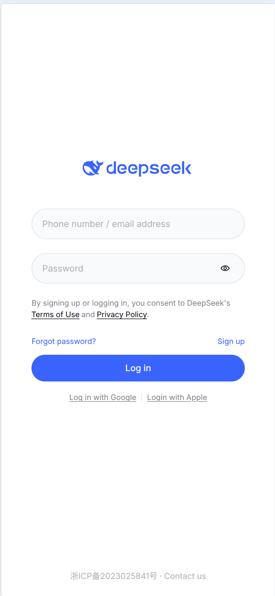
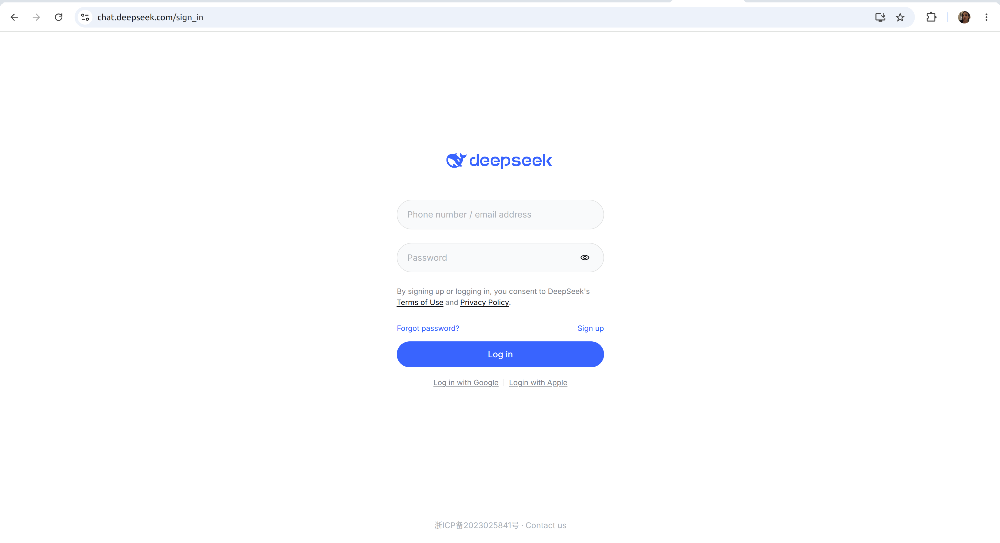

# DeepSeek Login Form Recreation

Recreate the DeepSeek login form shown in the screenshots below.

checkout deepseek's login url: https://chat.deepseek.com/sign_in

## Screenshots

### mobile viewport

### desktop viewport

## Instructions

1. Open the DeepSeek login page in your browser.
2. Open DevTools (right-click → Inspect, or press `F12`) to inspect the HTML and CSS.
3. Copy the relevant HTML and CSS and build your own page based on it.
4. Deploy your solution to GitHub Pages.

## Submission

Submit a PDF file that includes the hyperlink to your deployed GitHub Pages site + your name and ID to Canvas!

## Questions

Ask questions on Discord or on campus!
